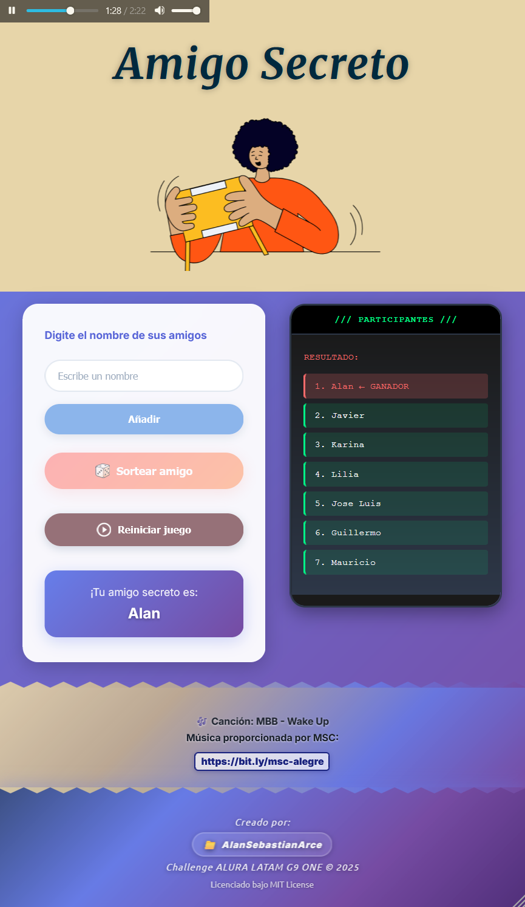

# 🎁 Secret Friend - Draw System (en) / Amigo Secreto - Sistema de Sorteo (es)

## 📷 Capturas de Pantalla



[](https://choosealicense.com/licenses/mit/)
[](https://developer.mozilla.org/en-US/docs/Web/HTML)
[](https://developer.mozilla.org/en-US/docs/Web/CSS)
[](https://developer.mozilla.org/en-US/docs/Web/JavaScript)

Un sistema web interactivo para realizar sorteos de "Amigo Secreto" de forma fácil y divertida, desarrollado como parte del Challenge ALURA LATAM G9 ONE.

## 🌟 Características

- ✅ **Interfaz intuitiva**: Diseño moderno y responsive
- 🎵 **Música de fondo**: Ambiente musical durante el uso
- 🎨 **Diseño atractivo**: Gradientes y animaciones suaves
- 📱 **Completamente responsive**: Funciona en móviles, tablets y desktop
- 🎲 **Sorteo aleatorio**: Sistema de selección completamente aleatorio
- 🔄 **Función de reinicio**: Posibilidad de empezar de nuevo
- 💾 **Sin dependencias externas**: No requiere conexión a internet para funcionar

## 🚀 Demo en Vivo

[Ver Demo](https://github.com/AlanSebastianArce/secret-friend-draw-system) _(Agrega aquí el link cuando lo subas)_

## 🛠️ Tecnologías Utilizadas

- **HTML5**: Estructura semántica del sitio
- **CSS3**: Estilos avanzados con gradientes, animaciones y flexbox
- **JavaScript (Vanilla)**: Lógica del sorteo y manipulación del DOM
- **Google Fonts**: Tipografías Inter, Merriweather y Ubuntu

## 📁 Estructura del Proyecto

```
secret-friend-draw-system/
├── index.html              # Estructura principal
├── style.css               # Estilos CSS
├── secret-friend.js  # Lógica JavaScript
├── assets/                 # Imágenes e iconos
│   ├── secret-friend.png
│   ├── dices.png
│   └── play_circle_outline.png
├── audio/                  # Archivos de audio
│   └── wake-up-mbb.mp3
├── LICENSE                 # Licencia MIT
└── README.md              # Documentación
```

## 🎮 Cómo Usar

1. **Agregar participantes**: Escribe los nombres de los participantes en el campo de texto y presiona "Añadir"
2. **Ver lista**: Los nombres aparecerán en la pantalla de "PARTICIPANTES"
3. **Realizar sorteo**: Una vez agregados todos los nombres, presiona "Sortear amigo"
4. **Ver resultado**: El nombre del amigo secreto aparecerá destacado
5. **Reiniciar**: Si deseas hacer un nuevo sorteo, presiona "Reiniciar juego"

## 💻 Instalación Local

1. Clona el repositorio:
```bash
git clone https://github.com/AlanSebastianArce/secret-friend-draw-system.git
```

2. Navega al directorio del proyecto:
```bash
cd secret-friend-draw-system
```

3. Abre `index.html` en tu navegador web favorito o usa un servidor local:
```bash
# Con Python 3
python -m http.server 8000

# Con Node.js (http-server)
npx http-server

# Con PHP
php -S localhost:8000
```

4. Visita `http://localhost:8000` en tu navegador

## 🎨 Características de Diseño

- **Paleta de colores**: Gradientes azul-púrpura con acentos dorados
- **Tipografías**:
  - Merriweather: Títulos elegantes
  - Inter: Texto principal
  - Ubuntu: Footer
  - Courier New: Pantalla de participantes (efecto terminal)
- **Efectos visuales**: Glassmorphism, sombras, animaciones CSS
- **Responsive**: Breakpoints optimizados para móviles

## 🔧 Personalización

El proyecto está estructurado para ser fácilmente personalizable:

- **Colores**: Modifica las variables CSS en la parte superior del archivo `style.css`
- **Música**: Reemplaza el archivo de audio en la carpeta `audio/`
- **Imágenes**: Cambia las imágenes en la carpeta `assets/`

## 🤝 Contribuciones

Las contribuciones son bienvenidas. Para cambios importantes:

1. Fork el proyecto
2. Crea una rama para tu feature (`git checkout -b feature/AmazingFeature`)
3. Commit tus cambios (`git commit -m 'Add some AmazingFeature'`)
4. Push a la rama (`git push origin feature/AmazingFeature`)
5. Abre un Pull Request

## 🎵 Créditos de Audio

- **Música**: "Wake Up" by MBB
- **Fuente**: Music Shared Collection (MSC)
- **Enlace**: [https://bit.ly/msc-alegre](https://bit.ly/msc-alegre)

## 📝 Licencia

Este proyecto está bajo la Licencia MIT. Ver el archivo [LICENSE](LICENSE) para más detalles.

## 👨‍💻 Autor

**Alan Sebastian Arce**
- GitHub: [@AlanSebastianArce](https://github.com/AlanSebastianArce)
- LinkedIn: _[https://www.linkedin.com/in/alansebastianarce]_

## 🏆 Challenge

Este proyecto fue desarrollado como parte del **Challenge ALURA LATAM G9 ONE** © 2025

---

## 🔍 Desarrollo

### Metodología de Desarrollo
Este proyecto fue desarrollado combinando:
- **Desarrollo manual**: Estructura HTML, gran parte del CSS y funcionalidades JavaScript
- **Asistencia de IA**: Algunas optimizaciones y mejoras fueron realizadas con ayuda de Claude AI

### Funcionalidades Técnicas
- Validación de entrada de datos
- Generación de números aleatorios para el sorteo
- Manipulación del DOM en tiempo real
- Gestión de estados de la aplicación
- Responsive design con CSS Grid y Flexbox

---

⭐ **¡Si te gusta el proyecto, no olvides darle una estrella!** ⭐